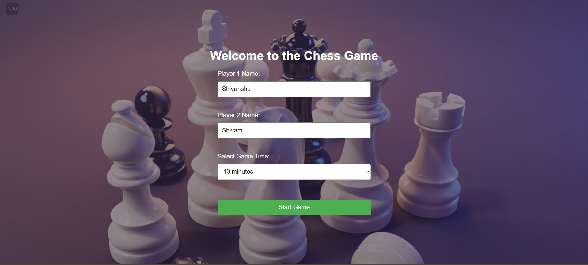

# Chess Game

A feature-rich, web-based chess game with timer functionality, a leaderboard system, and game state management.

## Features

- Two-player chess game with full rule implementation
- Customizable timer for each player
- Leaderboard system to track player ratings
- Save and load game functionality for interrupted games
- Responsive design for seamless play on various devices
- Castling and en passant move support
- Pawn promotion to queen
- Check and checkmate detection

## Technologies Used

- HTML5 for structure
- CSS3 for styling and responsive design
- Vanilla JavaScript for game logic and DOM manipulation
- Local Storage API for saving game states and player data

## How to Play

1. Open `index.html` in a modern web browser.
2. On the landing page, enter the names of Player 1 and Player 2.
3. Select the game time from the dropdown menu (options range from 1 to 20 minutes).
4. Click "Start Game" to begin the match.
5. Players take turns moving their pieces according to standard chess rules:
   - Click on a piece to select it
   - Valid moves will be highlighted in green
   - Click on a highlighted square to move the selected piece
6. The game ends when one player checkmates the other, or when a player's time runs out.

## Game Controls and Features

- Piece Movement: Click to select, click again to move
- Save Game: Click "Save Game" and enter a name to save the current game state
- Load Game: Click "Load Game" and enter the name of a saved game to resume
- Delete Game: Remove a saved game from storage
- New Game: Start a fresh game at any time
- Leaderboard: View player rankings based on their performance

## Chess Rules Implemented

- Standard piece movements for all chess pieces
- Castling (both kingside and queenside)
- Pawn promotion to queen upon reaching the opposite end of the board
- Check and checkmate detection
- Prevention of illegal moves that would put the king in check

## Leaderboard System

The leaderboard tracks player ratings using a simple Elo-like system:
- Each player starts with a base rating of 400
- After each game:
  - The winner gains 100 points
  - The loser loses 100 points
- Ratings are stored locally and persist between sessions

## File Structure

- `index.html`: Landing page for game setup
- `HTML/chess.html`: Main chess game interface
- `CSS/chess.css`: Styles for the chess board and UI elements
- `JS/chess.js`: Core game logic, move validation, and timer functionality
- `CRUD/crud.js`: Functions for saving, loading, and deleting game states
- `images/`: Directory containing chess piece images and background assets

## Future Improvements

- Implement online multiplayer functionality using WebSockets
- Add an AI opponent with adjustable difficulty levels
- Enhance mobile responsiveness for smaller screens
- Introduce sound effects for moves, captures, and game events
- Add animations for piece movements and captures
- Implement a more sophisticated rating system (e.g., true Elo rating)
- Add support for custom time controls (e.g., increment modes)
- Introduce a replay feature to review completed games

## Known Issues

- Rare edge cases in check detection for complex board positions
- Occasional visual glitches when rapidly moving pieces.

## Contributing

Contributions are welcome! Please feel free to submit a Pull Request.

## Acknowledgements

- Chess piece images from [Chess.com](https://www.chess.com/)
- Background video from [Pexels](https://www.pexels.com/)